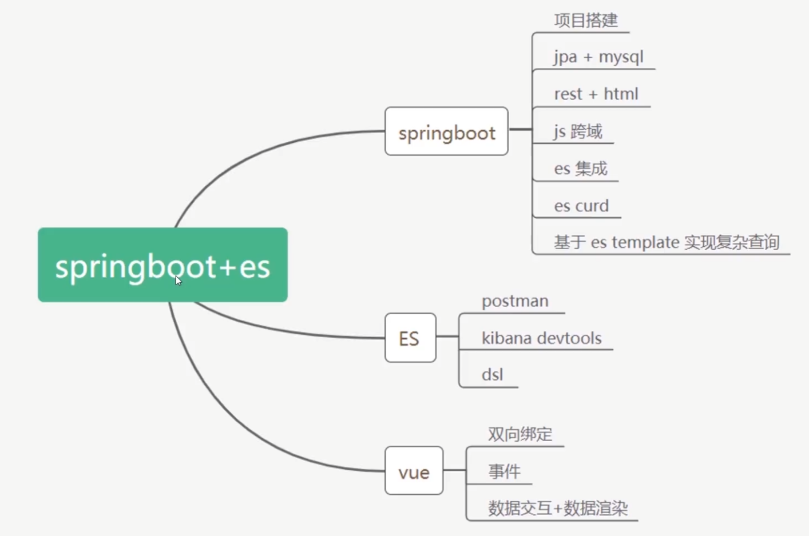

# Springboot+ElasticSearch构建博客检索系统

> 项目说明

​	视频地址：https://www.imooc.com/learn/1161

​	项目源码：https://github.com/holic-x/springboot-es

​	项目笔记：https://github.com/holic-x/springboot-es/tree/master/fileStore

​	其他辅助资料：code/前端页面、code/other：数据库文件blog.sql、postman接口请求

> 学习内容

​	结合实际需求分析，打造个人博客检索系统。内容涵盖 ES安装、ES基本概念和数据类型、Mysql 到 ES 数据同步、SpringBoot 操作 ES。可初步认识ES，理解ES的一些适用场景，以及如何使用springboot来同ES进行交互

1、ElasticSearch概念和适用场景 

2、ElasticSearch 数据类型，和关系型数据库mysql的对比

3、Mysql数据同步到ES（logstash, mysql binlog, 第三方Go框架）

4、Springboot 整合操作ES 

5、ElasticSearch 安装中文分词器

> 技术栈

