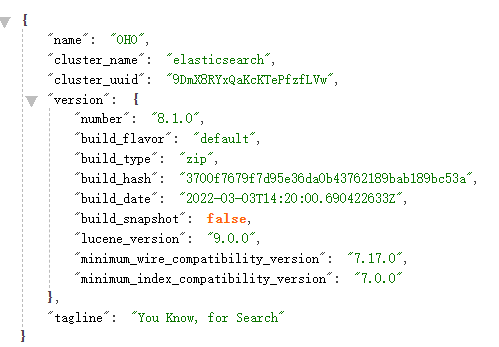
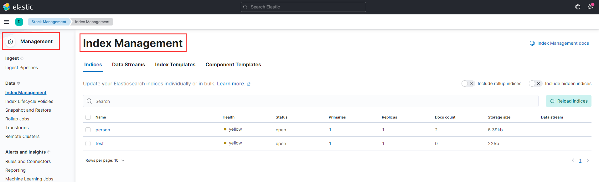
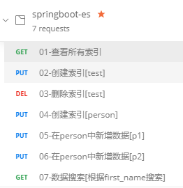
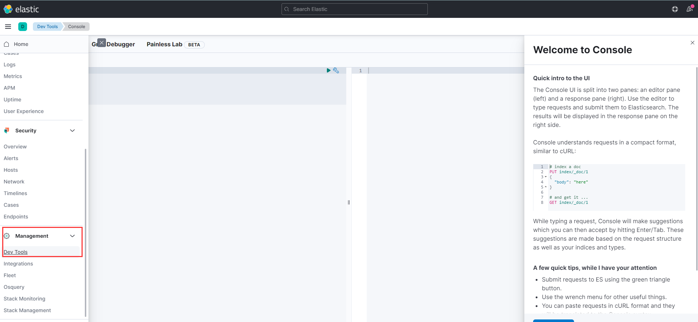
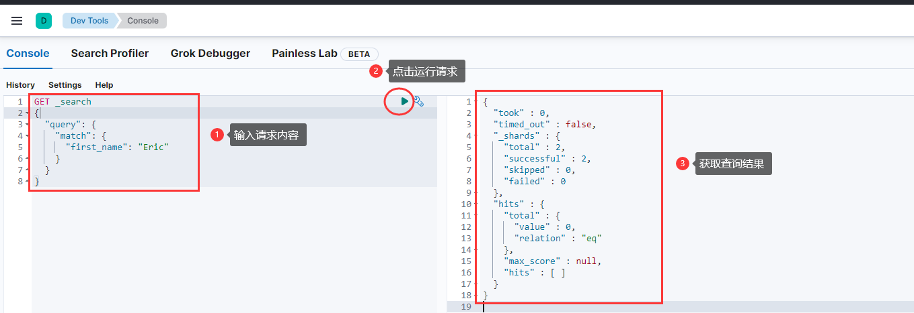

# 初识ElasticSearch

> 内容说明

1.ElasticSearch的概念和适用场景

2.ElasticSearch VS Mysql

3.ElasticSearch的安装与部署


## 1.ElasticSearch的概念和适用场景

​	Elasticsearch 是一个分布式、RESTful 风格的搜索和数据分析引擎，能够解决不断涌现出的各种用例。 作为 Elastic Stack 的核心，它集中存储您的数据，帮助您发现意料之中以及意料之外的情况。

​	**关键字**：分布式（Node & Cluster）、全文检索、实时快速、Restful

​		Elasticsearch 构建基于lusnegn之上，目前是业内首选的一种通用解决方案，在构建企业级搜索服务的应用场景中使用较为广泛。常见的应用场景有电商系统、知识系统、日志分析、标签工程等，在大量数据之上用到搜索分析功能时均可考虑引用ElasticSearch


> 分布式

​	ES可以单点运行也可以在多节点的集群环境下运行，索引数据通过分片算法散列在不同的节点之上，从而实现高可用、负载均衡的分布式搜索服务

> 全文检索

​	对于全文内容都需要用到搜索功能（例如在博客系统中需要通过关键字对文章的标题、内容进行检索），则需引入全文检索。常用的全文检索工具有Lucene、solr

> 实时快速

​	Elasticsearch可以实时快速存储、搜索、分析海量数据。例如维基百科、github、stackoverflow这些网站都引用到es

> Restful

​	友好的Restful API交互方式，不需要额外编写复杂逻辑代码或者掌握额外的语言的SDK，而是通过简单的通用的http请求实现对document、index的管理。


## 2.ElasticSearch VS Mysql

> mysql VS es

| Mysql    | ES       |
| -------- | -------- |
| database | index    |
| table    | type     |
| row      | document |
| column   | field    |
| schema   | mapping  |

> 举例分析

​	从用户表中搜索用户名为张三的信息

- mysql执行分析

​	从user数据库中根据name属性检索数据表user_info

```sql
select * from user.user_info where name = '张三';
```

- es执行分析

​	通过restful api根据field检索内容

```
GET /user/user_info/_search?q=name:张三
```


## 3.ElasticSearch的安装与部署

> 软件说明

​	视频中引用的Elasticsearch6.3.2 最低JDK版本要求1.8

​	项目中所使用的elasticsearch、logstash、kibana的版本均为 8.1.0 （es体系协同合作，尽量保持版本一致，不同版本在springboot整合操作的语法也相应有所区别）

​	[elasticsearch最新下载](https://www.elastic.co/cn/downloads/elasticsearch)、[历史版本下载](https://www.elastic.co/downloads/past-releases#elasticsearch)

​	[kibana下载](https://www.elastic.co/cn/downloads/kibana)、[logstash下载](https://www.elastic.co/cn/downloads/logstash)

​	postman


> 软件安装

​	下载完成之后直接解压后使用，此处基于win演示（如果是mac或者linux则相应下载指定版本利用shell运行即可）

​	解压es安装包，进入bin目录双击elasticsearch.bat文件等待es运行，随后访问localhost:9200，如果响应出现JSON字符串则说明单点的es运行成功



​	解压kibana安装包，进入bin目录双击kibana.bat（此处需注意kibana是配合es使用的，其对es有一定依赖，因此在启动kibana之前要确保已有es节点启动）或者通过cmd窗口进入指定目录启动，启动成功访问http://localhost:5601/app/home#/



### postman、kibana 与es的交互

> postman



​	<font color=red>不同版本api请求规则可能有所不同</font>

```cmd
# 01-查看所有索引
GET
localhost:9200/_all
```

```cmd
# 02-创建索引[test]
PUT
localhost:9200/test
```

```cmd
# 03-删除索引[test]
DELETE
localhost:9200/test
```

```cmd
# 04-创建索引[person]
PUT
localhost:9200/person
```

```cmd
# 05-在person中新增数据[p1]
PUT
localhost:9200/person/_doc/p1
{
	"first_name" : "John",
    "last_name" : "Smith",
    "age" : 25,
    "about" : "I love to go rock climbing",
    "interests" : [ "sports", "music" ]
}

# GET localhost:9200/person/_doc/p1 检索指定id文档
```

```cmd
# 06-在person中新增数据[p2]
PUT
localhost:9200/person/_doc/p2
```

```cmd
# 07-数据搜索[根据first_name搜索] 
localhost:9200/person/_search?q=first_name:john
```


> kibana

​	在management选项卡，点击dev tools进入控制台，随后可进行测试





## 4.可能会遇到的问题

### es 启动

- 在启动es的时候报错，类似如下

```
 error downloading geoip database [GeoLite2-City.mmdb]
```

> 解决方案：

​	在config/elasticsearch.yml中添加如下配置：(关闭geoip数据库)

```yml
ingest.geoip.downloader.enabled: false
```


- 如果出现下述问题，则需要手动关闭ssl认证

```
received plaintext http traffic on an https channel, closing connection Netty4HttpChannel{localAddress=/[0:0:0:0:0:0:0:1]:9200, remoteAddress=/[0:0:0:0:0:0:0:1]:54042}
```

> 解决方案：

​	在config/elasticsearch.yml中关闭ssl认证

```yml
xpack.security.http.ssl:
  enabled: true
  keystore.path: certs/http.p12
```


- 账号密码

​	当es正常启动，则可通过localhost:9200访问，如果需要输入密码（在开启了密码验证模式的情况下）


​	可以在config/elasticsearch.yml中调整验证规则免密验证即可

```yml
xpack.security.enabled: false
```

​	或者在保留安全验证配置的通知在es启动的时候进行设置（win下操作不太一样）

```
./bin/elasticsearch -d
./bin/elasticsearch-setup-passwords interactive
```

