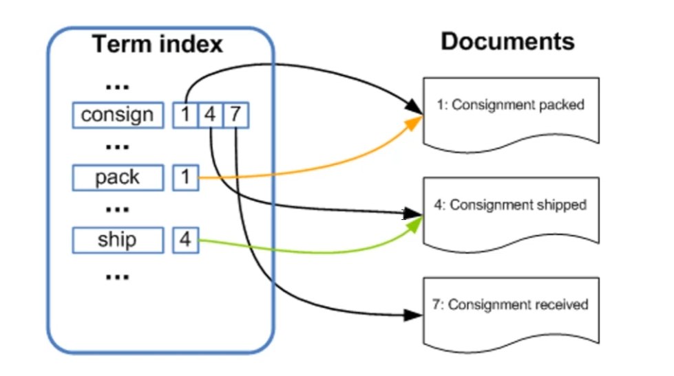
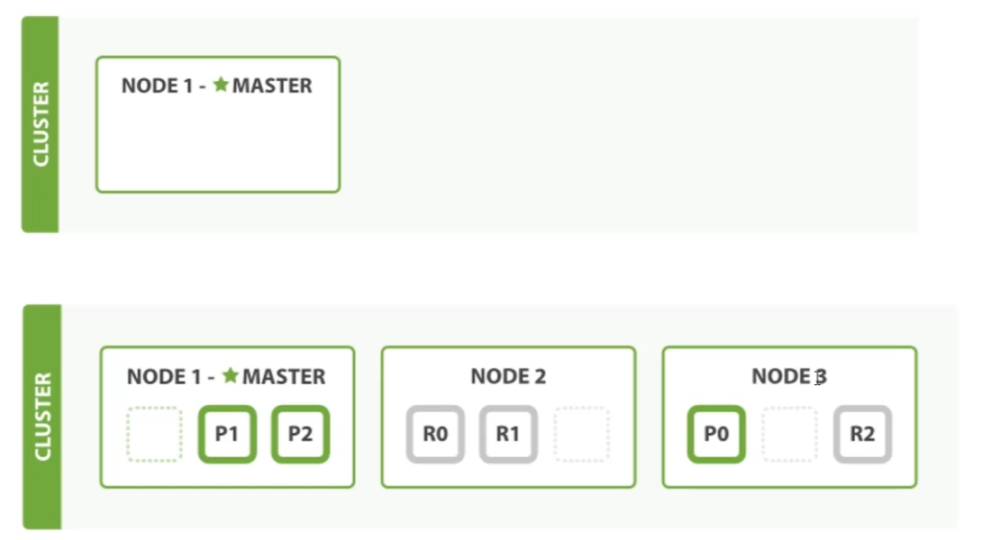

# 博客网站全文检索

​	通过个人博客全文检索的实际场景，了解现有mysql技术的局限性，并初步认识ES的检索性能

​	项目基于springboot构建个人博客demo


## 1.基于mysql实现

> 表结构设计

```sql
CREATE DATABASE blog;

USE blog;

CREATE TABLE `t_blog` (    
   `id` int(11) NOT NULL AUTO_INCREMENT COMMENT '自增id',    
   `title` varchar(60) DEFAULT NULL COMMENT '博客标题',    
   `author` varchar(60) DEFAULT NULL COMMENT '博客作者',    
   `content` mediumtext COMMENT '博客内容',    
   `create_time` datetime DEFAULT NULL COMMENT '创建时间',    
   `update_time` datetime DEFAULT NULL COMMENT '更新时间',    
   PRIMARY KEY (`id`)    
) ENGINE=InnoDB AUTO_INCREMENT=9 DEFAULT CHARSET=utf8mb4


# 模拟
INSERT INTO `blog`.`t_blog`(`id`, `title`, `author`, `content`, `create_time`, `update_time`) VALUES (1, 'Springboot 为什么这', 'bywind', '没错 Springboot ', '2019-12-08 01:44:29', '2019-12-08 01:44:34');
INSERT INTO `blog`.`t_blog`(`id`, `title`, `author`, `content`, `create_time`, `update_time`) VALUES (3, 'Springboot 中 Redis', 'bywind', 'Spring Boot', '2019-12-08 01:44:29', '2019-12-08 01:44:29');
INSERT INTO `blog`.`t_blog`(`id`, `title`, `author`, `content`, `create_time`, `update_time`) VALUES (4, 'Springboot 中如何优化', 'bywind', NULL, '2019-12-08 01:44:29', '2019-12-08 01:44:29');
INSERT INTO `blog`.`t_blog`(`id`, `title`, `author`, `content`, `create_time`, `update_time`) VALUES (5, 'Springboot 消息队列', 'bywind', NULL, '2019-12-08 01:44:29', '2019-12-08 01:44:29');
INSERT INTO `blog`.`t_blog`(`id`, `title`, `author`, `content`, `create_time`, `update_time`) VALUES (6, 'Docker Compose + Springboot', 'bywind', NULL, '2019-12-08 01:44:29', '2019-12-08 01:44:29');
```


> 数据检索

```sql
select * from t_blog
where title like '%spring%' or content like '%spring%';
```


> 结果分析

​	上述mysql操作结果"慢"的原因可能在于没有构建"索引"?但实际上在某些场景下即使构建索引也会失效

​	此外，mysql虽然支持fulltext索引类型，但部分场景下还是不适用于搜索或者全文检索。当随着业务增长数据量达到一定的程度，不可避免地面临一个话题“分布式架构”，相应后端的数据也需要进行拆分，从而引出“分库分表”概念，基于这种场景下针对id或者数值类型的字段可以使用hash或者其他的分片规则让分布式数据库中间件（mycat、shadingjdbc）映射到具体的数据节点，但搜索的场景是一种模糊的数据匹配，并不明确用户的输入规则（字符或者长度），因为没有办法对用户输入数据做hash或者其他算法转化，无法实现具体单库节点的准确映射。这个时候就会产生一个“结果过滤”的阶段：会对后端所有的数据节点做全表扫描再由中间件处理返回结果，而这个阶段于用户而言可以说是一种“灾难性的反馈”。

​	上述是基于检索性能方面的讨论，如果要综合搜索结果的权重、命中得分、关联性算法等因素考虑的话，mysql可能在某些场景下并不适合做全文检索


## 2.基于es实现

> 简单原理分析

​	es会对新增数据进行分词（可基于原生内部支持的分词或者其他自定义的分词规则），分词后es会维护一个“最小词源”到文档id的映射，参考如下所示：



​	当用户输入的句子中包含consign、pack关键字，es会对输入的内容进行拆分，随后根据拆分的最小词源对应找到对应的文档，随后将结果通过一些权重算法整合成最终结果反馈给用户。


> 基于es实现

​	一个运行时的es实例可以称之为一个节点node，而整个集群cluster则是由一个或者多个node组成，它们共同承担着数据和负载的压力。当出现节点变动（新增或者移除节点）时整个集群会重新平均分布数据



​		从上述图示分析，一开始集群中只有node1（主节点）、node2两个节点，当node3加入时，主节点node1会及时感知并且做后续一系列管理或者编排的工作（索引增删、节点增删等等操作），而主节点并不需要涉及到文档变更或者检索的操作，因此当集群中只有一个主节点的情况下即使用户流量非常大它也不会成为瓶颈。

​	任何节点都可以成为主节点，用户可以将请求发送到任一节点，每个节点都知道任一文档所存储的位置，并且可以将请求直接转发到存储文档的具体节点。也就是说，无论将请求发送到哪个节点，es都能够从各个包含所需文档的目标节点中收回数据并且响应数据给客户端。