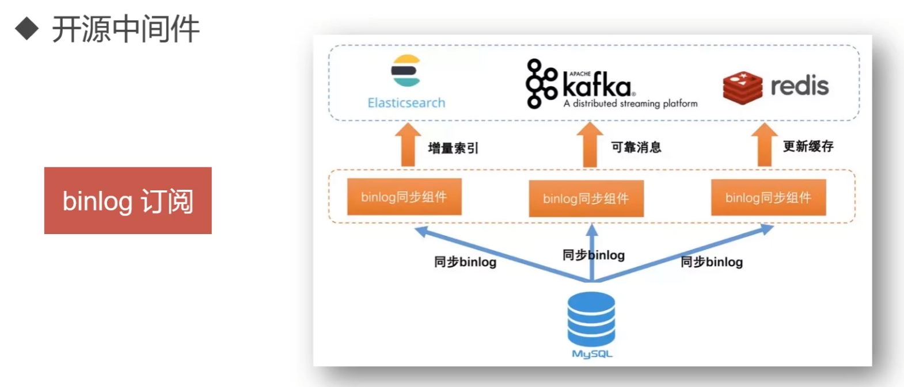
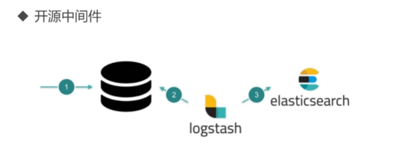
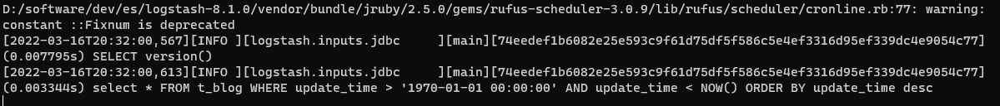
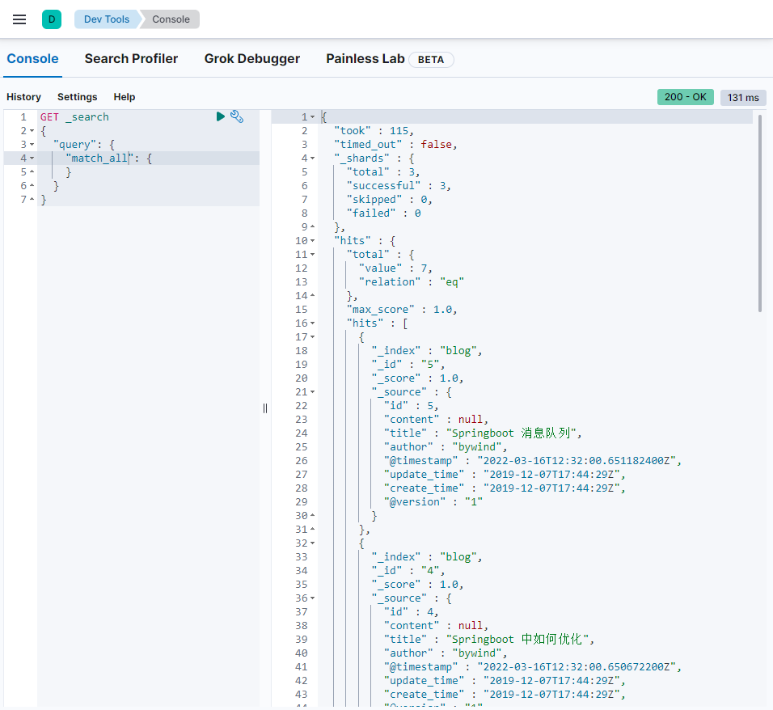
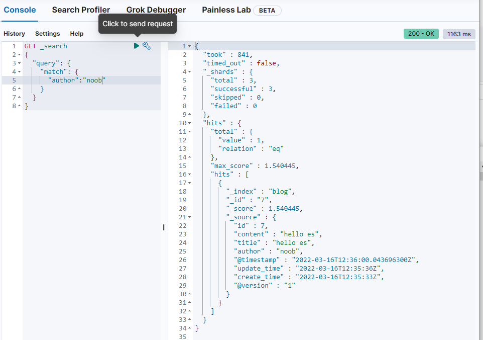
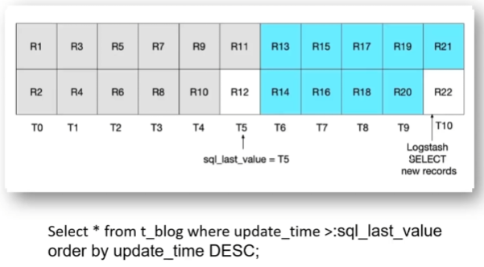
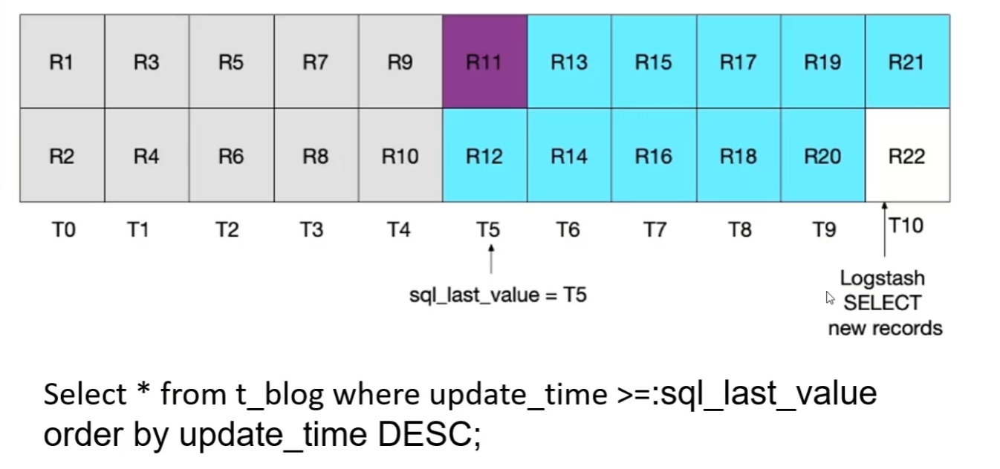
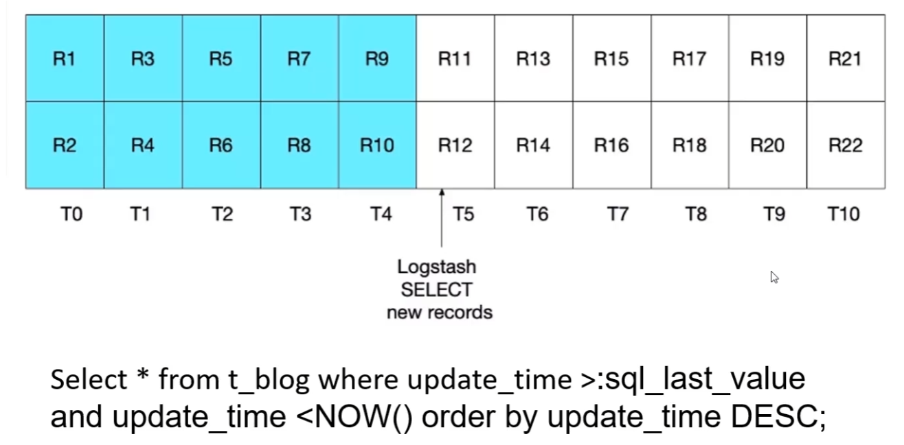

# mysql、es数据同步

## 1.数据同步

> 名词解释

​	在mysql、es数据同步的过程中需了解两个概念

​	**全量**：第一次当建立完es索引之后将mysql数据一次性打包到es中

​	**增量**：当mysql产生新的数据（新数据add、旧数据update或者delete）需es做相应的操作


## 2.实现方式

### 编写脚本

​	针对全量的场景，编写脚本：查询数据、数据处理、插入到es中

> 简单步骤说明如下：

```
1.通过mysql语句查询数据
2.在程序中对查询的结果进行处理
3.将处理的内容推送到es
```

> 衍生问题

​	基于上述操作，可能存在一个场景问题，如果在查询或者处理的过程中产生了新的数据怎么办？

- 解决方案

​	可以选择一个“**截断点**”，例如按照“更新时间”为维度，记录此次同步的最大时间节点，后续数据批同步以此规则执行定时任务。

​	还有一种方式针对增量数据同步是通过“切面”的方式实现，在程序业务代码中相应的CRUD操作中配置切面进行数据同步。但基于这种方式会使得程序代码、业务逻辑与业务数据三者的耦合度过高，不利于业务和数据的隔离。


### 开源中间件

> binlog订阅

​	

​	基于mysql binlog订阅方式实现的中间件：[alibaba/canal](https://github.com/alibaba/canal)、[go-mysql-org/go-mysql-elasticsearch](https://github.com/go-mysql-org/go-mysql-elasticsearch)


> logstash

​	logstash是es官方的数据收集、同步组件



​	如果使用logstash进行同步，则数据表设计需要满足id、time字段

​	id：对应es中_id概念，id设置必须来自mysql的id字段。如果一条数据在mysql中被更新，则es所有关联文档都应该被重启（先删除旧记录后新增新纪录）

​	time：mysql中需要有一个标识创建时间或者更新时间的字段，logstash可以实现每次请求只获取上次轮询之后更新或者插入的记录，从而实现增量同步。


## 3.logstash全量、增量同步解决方案

​	解压logstash安装包

> 步骤说明

1.引入mysql-connector-java.jar

​	[mysql-connector-java-5.1.31下载](https://mvnrepository.com/artifact/mysql/mysql-connector-java/5.1.31)

2.配置config/mysql.conf

```properties
input{
    jdbc{
        # 指定jdbc驱动包位置(不同版本处理不同，此处可直接将mysql驱动包放置logstash-core/lib/jars下，无需配置jdbc_driver_library)
        # jdbc_driver_library => "/xxx/logstash-7.5.0/mysql-connector-java-5.1.31.jar"
        # 要使用的驱动包类
        jdbc_driver_class => "com.mysql.jdbc.Driver"
        # mysql数据库的连接信息
        jdbc_connection_string => "jdbc:mysql://127.0.0.1:3306/blog"
        # mysql用户
        jdbc_user => "root"
        # mysql密码
        jdbc_password => "root"
        # 定时任务，多久执行一次查询，默认一分钟，如果想要没有延迟，可以使用 schedule => "* * * * * *"
        schedule => "* * * * *"
        # 清空上传的sql_last_value记录
        clean_run => true
        # 要执行的语句
        statement => "select * FROM t_blog WHERE update_time > :sql_last_value AND update_time < NOW() ORDER BY update_time desc"
    }
}

output {
    elasticsearch{
        # es host : port
        hosts => ["127.0.0.1:9200"]
        # 索引
        index => "blog"
        # _id (取到mysql数据库记录的id)
        document_id => "%{id}"
    }
}
```


> 执行同步操作

```
# 进入logstash安装目录
bin/logstash -f config/mysql.conf
```



​	随后检查同步结果：



​	在数据库中新增或修改数据，随后等待定时任务执行，检查同步结果




### sql分析

> V1.0

```sql
select * FROM t_blog 
WHERE update_time > :sql_last_value 
ORDER BY update_time desc
```

T：时间节点（以记录为参考）、R：行记录



​	正常情况下假设在T5时刻进行同步，此时会将R1-R11扫描出来并载入内容，当在T5这一时刻R12数据进来了，但R12并没有纳入此次扫描范围，且从sql分析可知包括在下一次同步的时候R12也被排除在外。以此类推，在之后的每个同步周期的时间节点都会有类似R12这样的记录存在，从而导致这一“临界点”数据同步失败


> V2.0

```sql
select * FROM t_blog 
WHERE update_time >= :sql_last_value 
ORDER BY update_time desc
```

​	为了解决上述问题，可进一步调整sql：将`update_time > :sql_last_value` 调整为`update_time >= :sql_last_value` 。

​	基于此次调整内容，虽然解决了R12记录节点能够正常被扫描，但也可以看到基于同一时刻的R11记录会被重复扫描，当数据体量达到一定程度，则会存在很多类似R11这样的记录被重复扫描，从而导致不必要的性能开销。




> V3.0

```sql
select * FROM t_blog 
WHERE update_time > :sql_last_value 
	AND update_time < NOW() 
ORDER BY update_time desc
```



​	该sql引入当前时间节点进行限制，从而解决了临界点数据漏扫问题，也避免了老数据重复扫描问题

