# springboot集成es

## 1.分词器介绍

> 分词器分类

​	standard：es默认的分词器，将词汇单元转为小写形式，并去除一些停用词和标点符号。（支持中文、单字切分）

​	simple：通过非字母字符分割文本信息，将文本单元统一为小写形式，去除数字类型字符。

​	whitespace：仅仅去除空格，没有任何lowcase化，不支持中文，对生成的词汇单元没有任何标准化处理

​	language：不支持中文


## 2.IK分词器的安装和使用	

### 分词器效果

> standard

- 对英文的支持

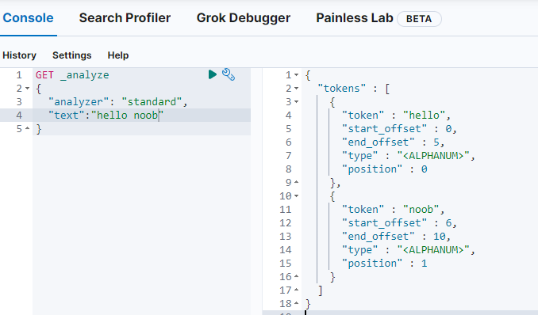

- 对中文的支持（完全拆分为单个汉字）


​	针对中文场景下，这种分词概念实际上并没有办法满足要求。国内也有大神们自定义根据语义自定义一套分词器（例如[elasticsearch-analysis-ik](https://github.com/medcl/elasticsearch-analysis-ik)）

​	可直接下载elasticsearch-analysis-ik预先编译好的包，版本与elastcisearch对应

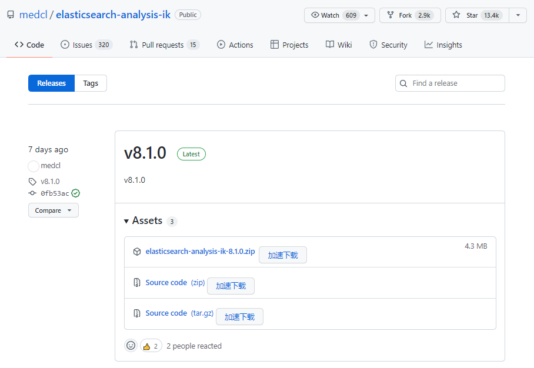

​		下载[elasticsearch-analysis-ik-8.1.0.zip](https://github.com/medcl/elasticsearch-analysis-ik/releases/download/v8.1.0/elasticsearch-analysis-ik-8.1.0.zip)文件，将内容解压至es安装目录的plugins文件夹下（可自定义目录名称），随后重启es再次访问，查看分词效果，可看到中文场景下不同的分词效果

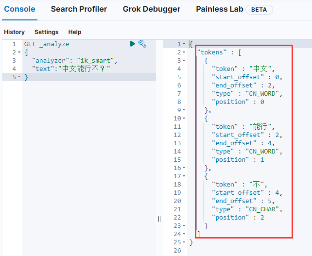

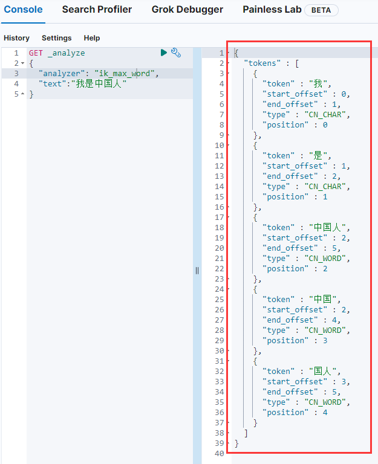

​	ik中内置了词典，当通过ik分词器进行内容拆分的时候，会先根据ik预先准备的字典进行拆分，如果在这个字典里面能够查到最小词源则不继续拆分而将查到的内容抽出来作为最小词云返回。

​	根据ik/config文件可以看到许多dic文件，这些文件存储了预制的最小词源（将一些常用的语义结构收录起来让es进行检索）

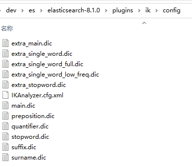

​	查看main.dic，可看到预制的词源内容，所以上述测试语句解析会出现上述结果。

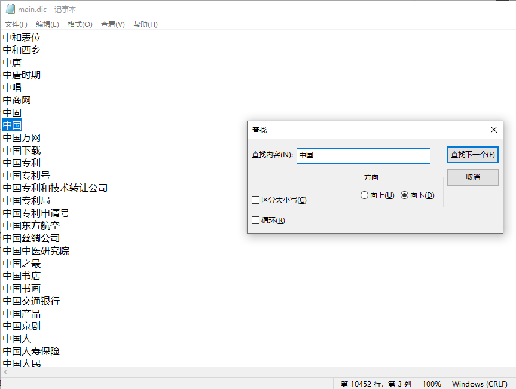

​	<font color=red>针对一些特殊场景，可以通过修改dic文件设置自定义的词源并重启es，随后es便可根据自身设定的词法解析语句</font>


## 3.springboot集成ES

> 构建步骤说明

1.springboot项目搭建

2.集成es（编写测试用例进行测试）

3.springboot编写程序请求es的restful api

4.vue.js处理结果


> 项目结构参考

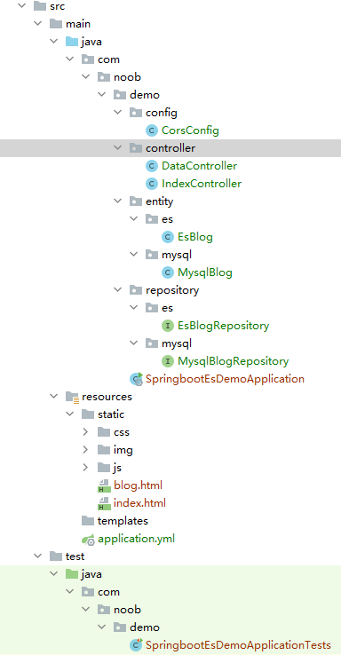


### 项目构建

> 创建一个新项目

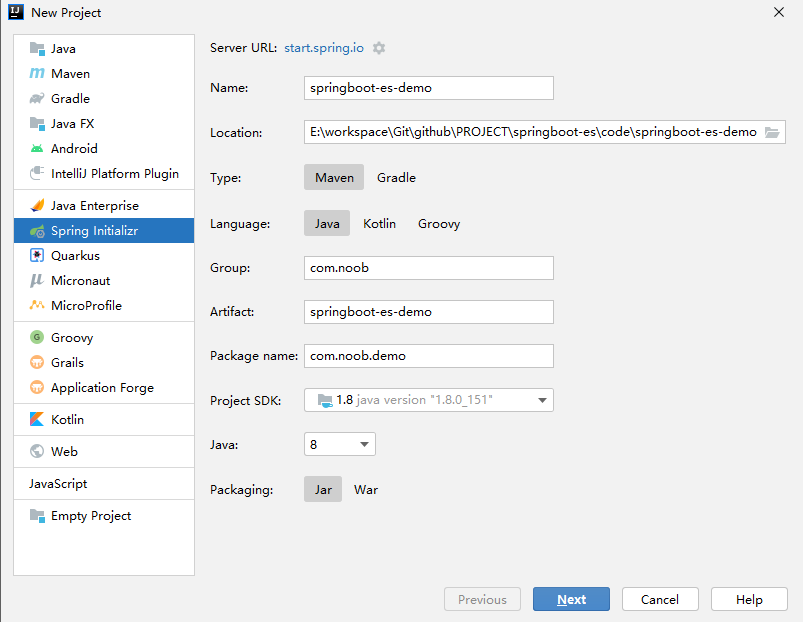

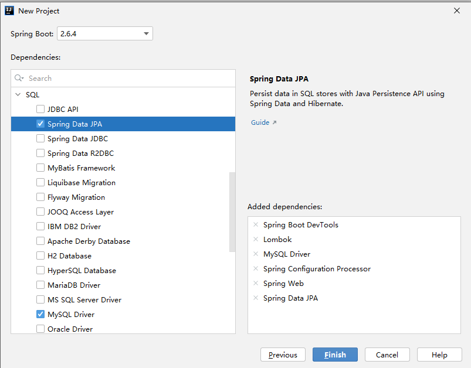

> 修改项目配置

💨maven仓库修改（如果引用默认则无需变动）

💨修改application.yml

```yml
server:
  port: 8080
spring:
  #数据库配置
  datasource:
    driver-class-name: com.mysql.jdbc.Driver
    url: jdbc:mysql://localhost:3306/blog?useUnicode=true&characterEncoding=utf-8
    username: root
    password: root
    # hikari 数据源专用配置(spring data jpa默认使用hikari数据库连接池)
    hikari:
      maximum-pool-size: 20
      minimum-idle: 5

  # jpa相关配置
  jpa:
    hibernate:
      ddl-auto: update
    show-sql: true
    # 数据库方言
    database-platform: org.hibernate.dialect.MySQLDialect

  # es 配置
  data:
    elasticsearch:
      cluster-nodes: 127.0.0.1:9200
      cluster-name: my-application

  # mvc 静态资源映射
  mvc:
    static-path-pattern: /**

  # 静态资源热部署
  devtools:
    livereload:
      enabled: true
    restart:
      additional-paths: static/**

  # 日期格式化
  jackson:
    date-format: yyyy-MM-dd HH:mm:ss
```

💨整合前端静态资源（将前端的页面引入到resource/static资源文件夹下）

✔启动项目，访问测试

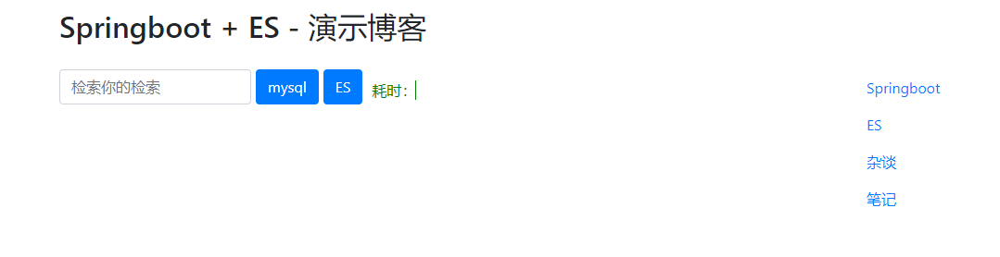

### 整合es

> 在pom.xml中引入es依赖

```xml
<!--引入elasticsearch-->
<dependency>
    <groupId>org.springframework.boot</groupId>
    <artifactId>spring-boot-starter-data-elasticsearch</artifactId>
</dependency>
```

> 新增EsBlog、EsBlogRepository

```java
@Data
@Document(indexName = "blog", useServerConfiguration = true, createIndex = false)
public class EsBlog {

    @Id
    private Integer id;

    @Field(type = FieldType.Text,analyzer = "ik_max_word")
    private String title;

    @Field(type = FieldType.Text,analyzer = "ik_max_word")
    private String author;

    @Field(type = FieldType.Text,analyzer = "ik_max_word")
    private String content;

    @Field(type = FieldType.Date,format = DateFormat.custom,pattern = "yyyy-MM-dd HH:mm:ss||yyyy-MM-dd||epoch_millis")
    private String createTime;

    @Field(type = FieldType.Date,format = DateFormat.custom,pattern = "yyyy-MM-dd HH:mm:ss||yyyy-MM-dd||epoch_millis")
    private String updateTime;

}
```

```java
public interface EsBlogRepository extends ElasticsearchRepository<EsBlog,Integer> {
}
```

> 编写测试样例

```java
@SpringBootTest
class SpringbootEsDemoApplicationTests {

    @Autowired
    private EsBlogRepository esBlogRepository;

    @Test
    public void testEsBlog(){
        Iterable<EsBlog> all = esBlogRepository.findAll();
        Iterator<EsBlog> iterator = all.iterator();
        while (iterator.hasNext()){
            System.out.println(iterator.next());
        }
    }

}
```

> 测试

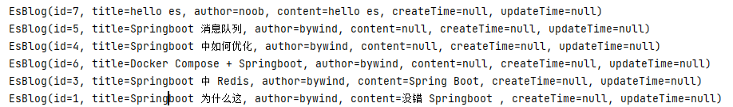


## 4.接口封装

> 具体参考相应的代码示例

mysql相关处理：MysqlBlog、MysqlBlogRepository

es相关处理：EsBlog、EsBlogRepository

接口封装：IndexController、DataController

静态资源：index.html（主页）、blog.html（博客详情）

跨域配置：CorsConfig


### es操作

​	es的依赖引入有两种形式，一种是使用springboot集成的spring-boot-starter-data-elasticsearch，另外一种是直接引入spring-data-elasticsearch以及关联依赖。springboot2.6.4版本集成的es是4.3.2，相应支持的es版本也有所不同，具体可参考[官网说明](https://spring.io/projects/spring-data-elasticsearch#learn)

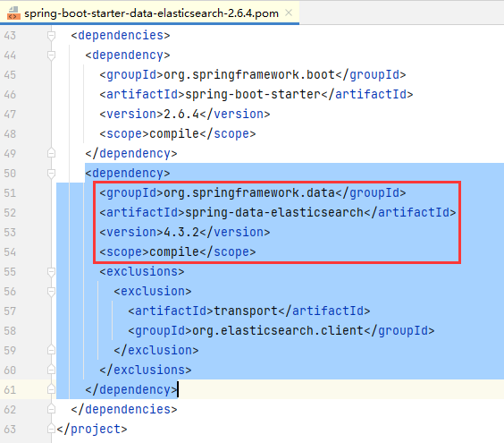

​	查看官网或者源码，该版本ElasticsearchRepository只提供了一个searchSimilar方法（与视频中使用的search有所区别），因此在es操作的时候并没有参考视频讲解的做法，而是根据相应版本调整es操作

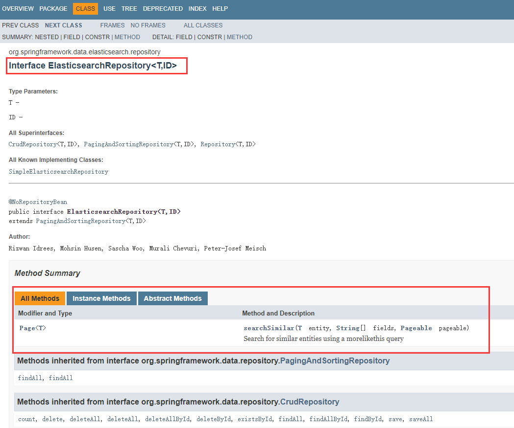
